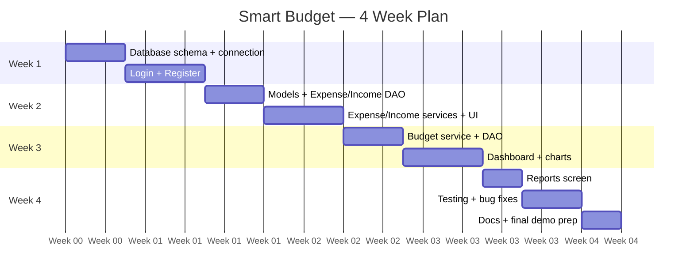
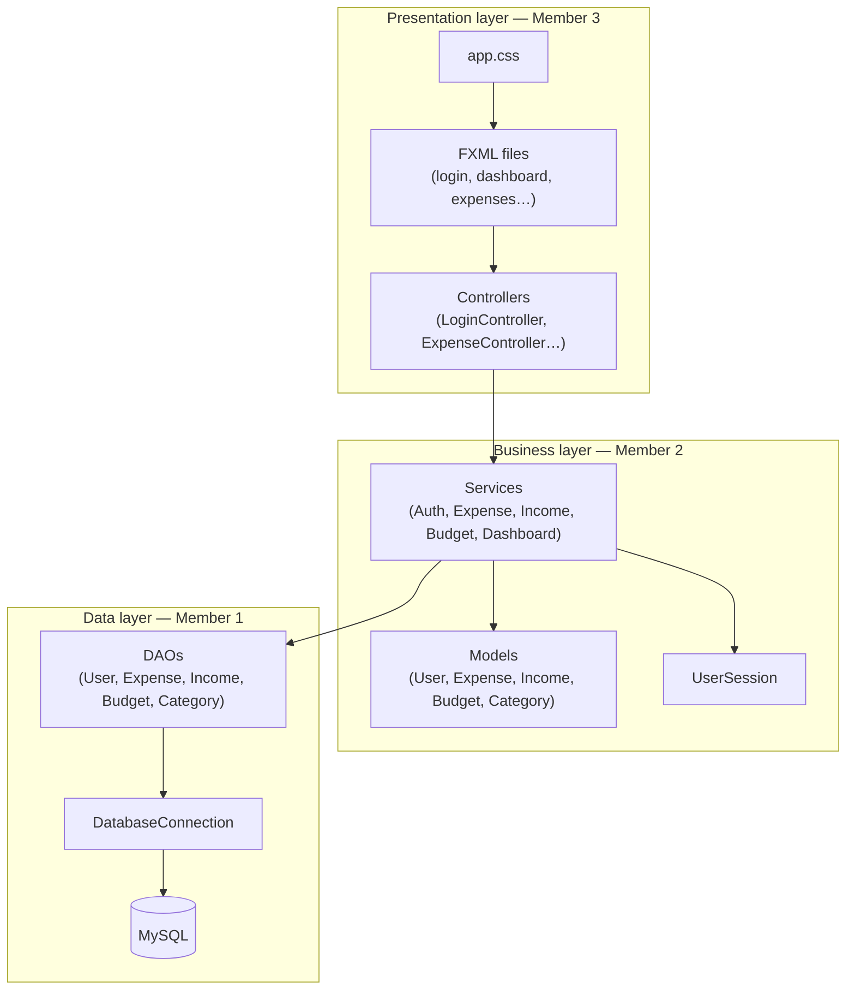
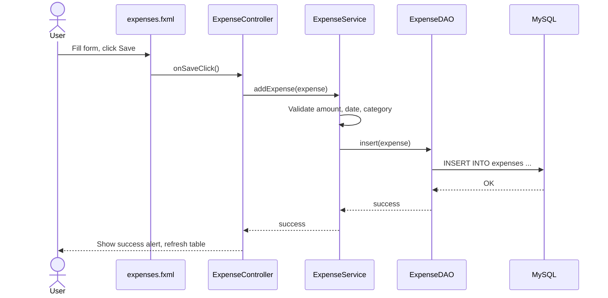
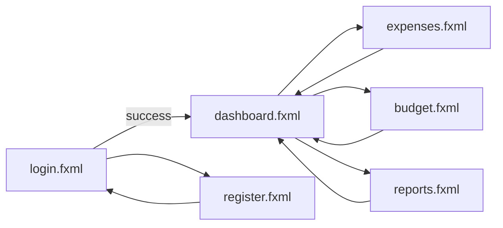
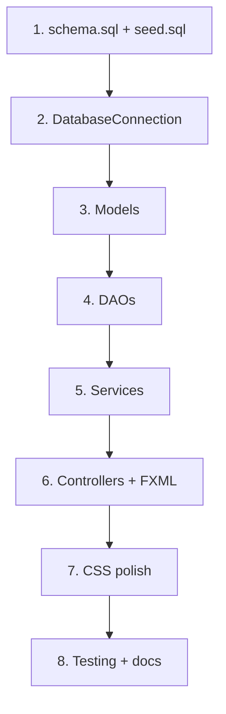

# Smart Budget Management System

**Team guide** for a 3-person, 4-week class project (JavaFX + MySQL + MVC).

Use this document as your single source of truth: who does what, how code flows, when to test, and what “done” looks like each week.

---

## Table of contents

1. [Quick start](#quick-start)
2. [End product & timeline](#end-product--timeline)
3. [System flow (how the app works)](#system-flow-how-the-app-works)
4. [Project workflow (how the team works)](#project-workflow-how-the-team-works)
5. [Team roles & workload](#team-roles--workload)
6. [Build phases (week by week)](#build-phases-week-by-week)
7. [Testing guide](#testing-guide)
8. [Git & daily routine](#git--daily-routine)
9. [Project structure](#project-structure)
10. [Rules everyone must follow](#rules-everyone-must-follow)

---

## Quick start

```bash
# 1. Clone / open project, switch to dev branch
git checkout dev

# 2. Create database (Member 1 maintains these files)
mysql -u root -p < database/schema.sql
mysql -u root -p < database/seed.sql

# 3. Set DB password in DatabaseConfig.java (local only — do not commit real passwords)

# 4. Run the app
mvn clean javafx:run
```

**Architecture in one line:**  
`FXML (UI) → Controller → Service → DAO → MySQL`

---

## End product & timeline

### What you submit at the end (Week 4)

| Deliverable | Owner | Description |
|-------------|--------|-------------|
| Working desktop app | All | Login, add/view expenses & income, set budget, dashboard totals, simple report |
| MySQL database | Member 1 | `schema.sql` + `seed.sql` run without errors |
| Source code | All | Clean MVC; each layer only talks to the layer below |
| Short demo (5–10 min) | Member 3 leads | Walk through login → add expense → dashboard → report |
| Documentation | All | UML + report in `docs/` (use `docs/README.md` as checklist) |
| Basic tests | Member 2 leads | At least a few JUnit tests on services or DAOs |

### 4-week timeline (overview)



> Adjust start dates to your real semester. The **order** matters more than exact dates.

### Milestone checklist

| Week | Milestone | Pass criteria |
|------|-----------|---------------|
| **1** | Foundation | App opens; user can register & login; session stores logged-in user |
| **2** | Transactions | User can add, list, delete expenses & income |
| **3** | Budget & dashboard | Monthly budget saved; dashboard shows income, expenses, remaining |
| **4** | Release | Report screen works; no crash on happy path; docs + demo ready |

---

## CURRENT PROGRESS STATUS (as of 2026-06-10)

> **Branches:** `dev` (Member 1), `member2-services` (Member 2), `weekly-staging` (Member 3 integration)

### Member 1 — Data Layer (`dev` branch)

**Week 1 Milestone: 50% COMPLETE**

| Component | Status | Details |
|-----------|--------|---------|
| `database/schema.sql` | ✅ COMPLETE | All tables created: `users`, `categories`, `expenses`, `incomes`, `budgets` + indexes |
| `database/seed.sql` | ✅ COMPLETE | Demo data: 2 users, 5 categories, sample expenses/incomes/budgets |
| `models/User.java` | ✅ COMPLETE | Full POJO with getters/setters, constructors, toString |
| `models/Category.java` | ✅ COMPLETE | Full POJO |
| `models/Expense.java` | ✅ COMPLETE | Full POJO with User & Category object relationships |
| `models/Income.java` | ✅ COMPLETE | Full POJO |
| `models/Budget.java` | ✅ COMPLETE | Full POJO |
| `database/DatabaseConnection.java` | ❌ NOT STARTED | **CRITICAL BLOCKER** — No connection pooling, no query methods |
| `dao/UserDAO.java` | ❌ NOT STARTED | **CRITICAL BLOCKER** — No register, login, findById, update methods |
| `dao/ExpenseDAO.java` | ❌ NOT STARTED | Needed for Week 2 |
| `dao/IncomeDAO.java` | ❌ NOT STARTED | Needed for Week 2 |
| `dao/CategoryDAO.java` | ❌ NOT STARTED | Needed for Week 2 |
| `dao/BudgetDAO.java` | ❌ NOT STARTED | Needed for Week 3 |
| `config/DatabaseConfig.java` | ❌ NOT STARTED | DB credentials file |

**Next Actions for Member 1:**
1. Implement `DatabaseConnection.getConnection()` (singleton, PreparedStatement support)
2. Implement `UserDAO`: `register()`, `findByUsername()`, `findById()`, `update()`
3. Test with MySQL before handing to Member 2

---

### Member 2 — Business Logic Layer (`member2-services` branch)

**Week 1 Milestone: 0% COMPLETE**

| Component | Status | Details |
|-----------|--------|---------|
| `services/AuthService.java` | ❌ NOT STARTED | **CRITICAL BLOCKER** — Depends on UserDAO; login, register, validatePassword |
| `session/UserSession.java` | ❌ NOT STARTED | **CRITICAL BLOCKER** — Singleton session manager for logged-in user |
| `utils/PasswordUtil.java` | ❌ NOT STARTED | Hash & verify passwords |
| `utils/AlertUtil.java` | ❌ NOT STARTED | Show error/success popups (used by controllers) |
| `utils/DateUtil.java` | ❌ NOT STARTED | Date formatting helpers |
| `services/ExpenseService.java` | ❌ NOT STARTED | Needed for Week 2 |
| `services/IncomeService.java` | ❌ NOT STARTED | Needed for Week 2 |
| `services/BudgetService.java` | ❌ NOT STARTED | Needed for Week 3 |
| `services/DashboardService.java` | ❌ NOT STARTED | Needed for Week 3 |
| `enums/ExpenseCategory.java` | ❌ NOT STARTED | Category enum or static list |
| `enums/UserRole.java` | ❌ NOT STARTED | User role enum |
| `exceptions/DatabaseException.java` | ❌ NOT STARTED | Custom exception class |
| `exceptions/ValidationException.java` | ❌ NOT STARTED | Custom exception class |

**Dependency Chain:**  
❌ `UserDAO` → ❌ `AuthService` → ✅ Ready for Member 3 UI

**Next Actions for Member 2:**
1. Wait for Member 1 to complete `DatabaseConnection` & `UserDAO`
2. Implement `PasswordUtil`: hash & verify methods
3. Implement `UserSession`: singleton with getter/setter for current user
4. Implement `AuthService`: login & register (calls UserDAO + PasswordUtil)
5. Create `PasswordUtil` & `AlertUtil` so Member 3 can build UI

---

### Member 3 — UI Layer (`weekly-staging` branch)

**Week 1 Milestone: 0% COMPLETE**

| Component | Status | Details |
|-----------|--------|---------|
| `Launcher.java` | ✅ NOT STARTED | **BLOCKER** — JavaFX entry point |
| `MainApplication.java` | ✅ NOT STARTED | **BLOCKER** — Scene builder, window setup |
| `controllers/LoginController.java` | ✅ NOT STARTED | Depends on AuthService |
| `controllers/RegisterController.java` | ✅ NOT STARTED | Depends on AuthService |
| `controllers/DashboardController.java` | ✅ NOT STARTED | Depends on UserSession |
| `resources/fxml/login.fxml` | ✅ NOT STARTED | Login screen layout |
| `resources/fxml/register.fxml` | ✅ NOT STARTED | Register screen layout |
| `resources/fxml/dashboard.fxml` | ✅ NOT STARTED | Dashboard screen layout |
| `resources/fxml/expenses.fxml` | ✅ NOT STARTED | Needed for Week 2 |
| `resources/fxml/budget.fxml` | ✅ NOT STARTED | Needed for Week 3 |
| `resources/fxml/reports.fxml` | ✅ NOT STARTED | Needed for Week 4 |
| `resources/css/app.css` | ✅ NOT STARTED | Styling |
| `controllers/ExpenseController.java` | ✅ NOT STARTED | Needed for Week 2 |
| `controllers/BudgetController.java` | ✅ NOT STARTED | Needed for Week 3 |
| `controllers/ReportController.java` | ✅ NOT STARTED | Needed for Week 4 |

**Dependency Chain:**  
✅ `AuthService` + ✅ `UserSession` → ✅ Controllers & FXML

**Next Actions for Member 3:**
1. Wait for Member 1 & 2 to complete core services
2. OR: Start with `Launcher` + `MainApplication` using mock/stub services
3. Build `login.fxml` + `LoginController` once `AuthService` interface is defined

---

### Blocker Analysis

**Critical Path (blocks all):**
```
Member 1: DatabaseConnection + UserDAO 
    ↓
Member 2: AuthService + UserSession + PasswordUtil
    ↓
Member 3: Launcher + LoginController + login.fxml
```

**Recommendation:** Member 3 can unblock immediately by:
- Starting `Launcher` + `MainApplication` today
- Using **mock/stub services** for testing UI layout
- Swapping in real services once Member 2 delivers

This prevents a 2-week waiting bottleneck.

---

## System flow (how the app works)

### Layer diagram

Every feature follows the same path. **Do not skip layers** (e.g. Controller must not call DAO directly).



### Example: user adds an expense



### Screen navigation flow



---

## Project workflow (how the team works)

### Development order (important)

Build **bottom to top**. Member 2 and 3 should not block Member 1 at the start.



### Handoffs between members

| Step | Who finishes | Who picks up | What must exist before next step |
|------|--------------|--------------|----------------------------------|
| 1 | Member 1 | Member 2 | Tables created; `DatabaseConnection.getConnection()` works |
| 2 | Member 2 | Member 3 | Models + DAO methods stubbed or working; Service method signatures agreed |
| 3 | Member 2 | Member 3 | `ExpenseService.addExpense()` etc. return real data |
| 4 | Member 3 | All | Controllers call services only; demo path works |

**Agree on method names early.** Example: `ExpenseService.getExpensesByUser(int userId)` — write signatures in a shared chat/doc before coding.

### Weekly team meeting (30 min)

- Demo what merged to `dev` this week  
- List blockers (e.g. “DAO not ready for expenses”)  
- Assign next 3 tasks per person  
- Update milestone checklist above  

---

## Team roles & workload

### Member 1 — Database & data access (~35% of code effort)

**You own:** everything that talks to MySQL.

| File / folder | Your tasks |
|---------------|------------|
| `database/schema.sql` | Create tables: `users`, `categories`, `expenses`, `incomes`, `budgets` |
| `database/seed.sql` | Demo user + default categories |
| `config/DatabaseConfig.java` | Host, port, database name, username (password local only) |
| `database/DatabaseConnection.java` | Single place to open/close connections |
| `dao/*` | CRUD SQL only — no business rules |
| `services/AuthService.java` | Login, register, password check (uses `UserDAO` + `PasswordUtil`) |
| `session/UserSession.java` | Store current `User` after login |

**How to work:**

1. Finish `schema.sql` first and share ERD/table list with the team.  
2. Each DAO = one table (mostly). Methods like `findByUserId`, `insert`, `update`, `delete`.  
3. Use `PreparedStatement` only — never string-concat SQL with user input.  
4. When a Service needs new data, add the DAO method first, then tell Member 2.

**Do not:** put JavaFX code, validation rules, or UI logic in DAOs.

---

### Member 2 — Models & business logic (~35% of code effort)

**You own:** rules, calculations, and coordinating DAOs.

| File / folder | Your tasks |
|---------------|------------|
| `models/*` | Fields, constructors, getters/setters for all entities |
| `services/ExpenseService.java` | Add/list/delete expenses; validate amounts and dates |
| `services/IncomeService.java` | Same for income |
| `services/BudgetService.java` | Set monthly budget; compute remaining amount |
| `services/DashboardService.java` | Totals for dashboard (sum income, sum expenses, balance) |
| `enums/*` | `ExpenseCategory`, `UserRole` |
| `exceptions/*` | Throw `ValidationException`, `DatabaseException` where needed |
| `utils/DateUtil.java`, `PasswordUtil.java` | Shared helpers (with Member 1 for passwords) |
| `src/test/...` | **Lead testing** — unit tests on services |

**How to work:**

1. Wait for table structure from Member 1, then model classes match columns.  
2. Services call DAOs — never `Connection` directly.  
3. All validation happens here (e.g. expense amount > 0, budget month valid).  
4. Expose simple methods for Member 3, e.g. `List<Expense> getExpensesForCurrentUser()`.

**Do not:** write FXML or SQL in services.

---

### Member 3 — UI & user experience (~30% of code effort)

**You own:** what the user sees and clicks.

| File / folder | Your tasks |
|---------------|------------|
| `MainApplication.java`, `Launcher.java` | Load first screen, set window title/size |
| `controllers/*` | Wire buttons/fields to services; handle errors with `AlertUtil` |
| `resources/fxml/*` | Layout for all 6 screens |
| `resources/css/app.css` | Consistent look (spacing, fonts, buttons) |
| `utils/AlertUtil.java` | Show error/success popups |
| `docs/` + demo | Screenshots, slides, **lead final demo** |

**How to work:**

1. Start with `login.fxml` + `LoginController` once `AuthService` exists.  
2. Use `@FXML` fields and `initialize()` for tables and combos.  
3. Controllers stay thin: read input → call service → show result.  
4. Use `UserSession` for logged-in user id — don’t pass passwords between screens.

**Do not:** open database connections or write SQL in controllers.

---

### Workload summary table

| Area | Member 1 | Member 2 | Member 3 |
|------|:--------:|:--------:|:--------:|
| SQL / schema | ●●● | ○ | ○ |
| DAOs | ●●● | ○ | ○ |
| Auth | ●● | ○ | ● |
| Models | ○ | ●●● | ○ |
| Services | ● | ●●● | ○ |
| FXML / CSS | ○ | ○ | ●●● |
| Controllers | ○ | ○ | ●●● |
| Dashboard / charts | ○ | ●● | ●● |
| Unit tests | ● | ●●● | ● |
| Documentation / demo | ● | ● | ●●● |

● = primary owner · ○ = support only

---

## Build phases (week by week)

### Week 1 — Foundation (Member 1 leads)

| Day | Member 1 | Member 2 | Member 3 |
|-----|----------|----------|----------|
| 1–2 | Write `schema.sql`, `seed.sql`, test in MySQL Workbench | Sketch model fields on paper | Sketch wireframes for 6 screens |
| 3–4 | `DatabaseConnection`, `UserDAO`, `AuthService` | Create empty model classes | Build `login.fxml`, `register.fxml` (static) |
| 5–7 | Login/register DAO methods working | `User` model complete | `LoginController`, `RegisterController` wired to `AuthService` |

**Week 1 done when:** New user can register, login, and see empty dashboard.

---

### Week 2 — Expenses & income (Member 2 leads)

| Day | Member 1 | Member 2 | Member 3 |
|-----|----------|----------|----------|
| 1–2 | `ExpenseDAO`, `IncomeDAO`, `CategoryDAO` | `Expense`, `Income`, `Category` models + services | `expenses.fxml` layout (TableView + form) |
| 3–5 | Help fix SQL bugs | Validation, list/add/delete in services | `ExpenseController` full wiring |
| 6–7 | Code review | Income flow same as expense | Refresh table after add/delete |

**Week 2 done when:** Logged-in user can add and view expenses and income.

---

### Week 3 — Budget & dashboard (split lead: M2 + M3)

| Day | Member 1 | Member 2 | Member 3 |
|-----|----------|----------|----------|
| 1–2 | `BudgetDAO` | `BudgetService`, `DashboardService` totals | `budget.fxml` + `BudgetController` |
| 3–5 | Support queries | Budget vs spent calculation | `dashboard.fxml` labels/cards |
| 6–7 | — | Provide data for charts | Simple JavaFX `PieChart` or `BarChart` on dashboard |

**Week 3 done when:** Dashboard shows correct totals and budget status.

---

### Week 4 — Reports, test, ship (All)

| Day | Member 1 | Member 2 | Member 3 |
|-----|----------|----------|----------|
| 1–2 | Fix DB bugs from testing | JUnit tests for main services | `reports.fxml` + `ReportController` |
| 3–4 | Final seed data | Integration fixes with Member 3 | CSS polish, error messages |
| 5–7 | SQL script in submission zip | Test report / bug list | Demo script + `docs/` |

**Week 4 done when:** Milestone “Release” row in table above is all checked.

---

## Testing guide

### What to test

| Type | Who leads | What | Tool |
|------|-----------|------|------|
| **Unit** | Member 2 | Service methods (validation, totals) | JUnit 5 in `src/test` |
| **DAO** | Member 1 | Manual or simple test with test DB | MySQL Workbench / JUnit |
| **UI / manual** | Member 3 | Full user paths below | Run app |
| **Integration** | All | Controller → Service → DAO → DB | Run app on `dev` |

### Manual test script (run before demo)

1. Register new user → login → logout → login again  
2. Add 3 expenses (different categories) → list shows all  
3. Add income → dashboard total updates  
4. Set monthly budget → remaining amount correct  
5. Open reports → numbers match dashboard  
6. Invalid input (empty amount, negative) → error alert, no crash  

### Bug reporting

Create a simple table in `docs/` or GitHub Issues:

| ID | Steps | Expected | Actual | Assigned to | Fixed |
|----|-------|----------|--------|-------------|-------|

---

## Git & daily routine

### Branches

| Branch | Purpose |
|--------|---------|
| `main` | Submission-ready only — merge from `dev` at end of each week |
| `dev` | Daily integration — everyone merges here |
| `feature/...` | One feature per branch, e.g. `feature/expense-crud` |

### Daily routine (each member, 15–20 min)

1. `git pull origin dev`  
2. Work on your files only (see roles above)  
3. `git add` → `git commit -m "clear message"` → `git push`  
4. Open Pull Request to `dev` → ask one teammate to review  
5. Post in team chat: *what I did today / what I need tomorrow*

### Commit message examples

```text
feat(dao): add ExpenseDAO insert and findByUserId
feat(service): validate expense amount in ExpenseService
feat(ui): wire ExpenseController save button
fix(auth): handle wrong password on login
test: add BudgetService remaining balance test
```

---

## Project structure

```text
BudgetManagementSystem/
├── database/
│   ├── schema.sql              ← Member 1
│   └── seed.sql                ← Member 1
├── docs/                       ← All (Member 3 coordinates demo)
├── src/main/java/com/smartbudget/
│   ├── MainApplication.java    ← Member 3
│   ├── Launcher.java           ← Member 3
│   ├── config/                 ← Member 1
│   ├── database/               ← Member 1
│   ├── dao/                    ← Member 1
│   ├── models/                 ← Member 2
│   ├── services/               ← Member 2 (Auth shared with M1)
│   ├── controllers/            ← Member 3
│   ├── session/                ← Member 1
│   ├── utils/                  ← Shared (see file comments)
│   ├── enums/                  ← Member 2
│   └── exceptions/             ← Member 2
└── src/main/resources/
    ├── fxml/                   ← Member 3
    └── css/app.css             ← Member 3
```

---

## Rules everyone must follow

1. **Controllers → Services → DAOs only.** No shortcuts.  
2. **One feature at a time** on `feature/*` branches; merge often to `dev`.  
3. **Do not commit** real database passwords.  
4. **Communicate before changing** a class another member owns.  
5. **If blocked > 1 day**, ask the team — don’t wait until Week 4.  
6. **MVP first:** working simple screens beat perfect design.  

### Out of scope (unless lecturer approves extra credit)

JWT, PDF/Excel export, email notifications, savings goals, dark theme, audit logs, automatic backups.

---

## Need help?

| Problem | Ask |
|---------|-----|
| SQL / connection errors | Member 1 |
| Wrong totals / validation | Member 2 |
| UI not showing / FXML errors | Member 3 |
| Git merge conflicts | Whoever merged last + team call |

Good luck — stick to the layers, the weekly milestones, and the handoff table, and you can finish this in **4 weeks**.
